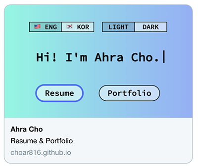

# intro-choar
저의 이력서와 포트폴리오를 정리한 웹사이트입니다.
- [배포 링크](https://choar816.github.io/intro-choar/)

## Tech Stack
`React`, `JavaScript`, `Redux`

## To do
- [x] 기획 및 디자인
- [x] CRA 없이 React 개발 환경 구축
- [x] 반응형 레이아웃 구현
  - [x] Main container의 전체적 레이아웃
  - [x] Resume - work experience, education
- [x] i18n 토글 기능 구현 (Redux)
  - [ ] 지역에 따른 기본 표시 언어 설정
- [x] 라이트모드/다크모드 토글 기능 구현 (Redux)
- [ ] 리렌더링 최적화
- [ ] Open Graph Meta Tags 추가

## Available Scripts
프로젝트 폴더 내에서 실행 가능한 명령어입니다.

### `yarn run dev`
개발모드로 앱을 실행합니다.
[http://localhost:8080](http://localhost:8080)에서 확인 가능합니다.

### `yarn run build`
`dist` 폴더에 앱을 빌드합니다.
